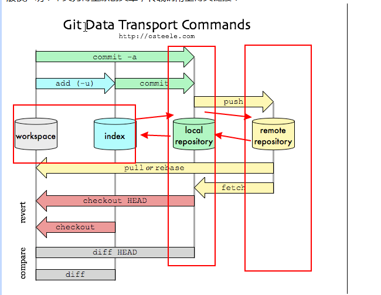

# git使用

## 基本操作



```shell
#生成私钥，你可以指定私钥密码。
ssh-keygen -t rsa -C "1468435744@qq.com" 

#验证是否ssh登录成功
ssh -T git@github.com
```


## 分支操作

```shell
#创建分支
git branch 1.0

#切换到分支
git checkout 1.0

#查看当前的分支
git branch 

#分支的合并，比如dev分支要合并到master，1.先切换到要被合并的分支 2.然后git merge dev
#如果我只需要合并部分内容怎么办？？有些内容仍然希望保持合并之前的样子
git checkout master
git merge dev

#在本地创建了分支之后，远程仓库也需要创建，这里提交就好了
git push origin dev:dev

#将远程origin/dev分支 和本地dev分支关联起来
git branch --set-upstream-to=origin/dev dev  

#查看远程分支和本地的对应关系
git branch -v-v


#如果本地是master,则提交到origin的master
git push origin master
#如果本地是dev,则提交到origin的dev
git push origin dev


#删除本地的分支
git branch -d dev
#删除远程仓库的分支
git push origin :dev 
git push origin --delete dev

```


## 远程仓库操作

```shell
#添加远程仓库
git remote add origin url

#查看远程仓库
git remote 

# 这个是更新本地仓库，但是workspace不会变
git fetch

# 相当于git fetch 加上 checkout HEAD,会直接更新workspace里面的内容
git pull

#
git push origin master

```

